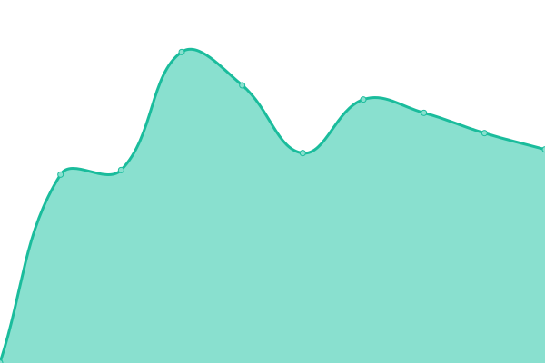
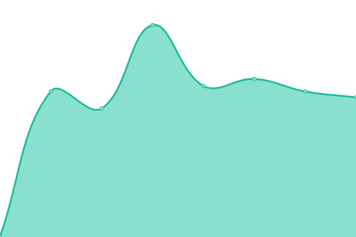
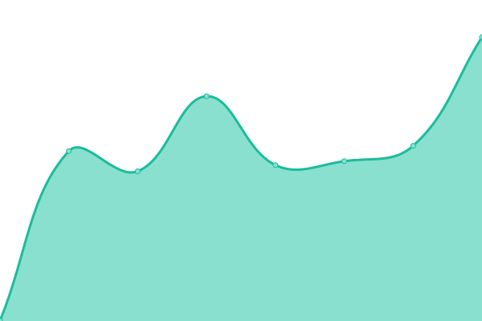

# [📈 Live Status](https://venkatoriga.github.io/origamonitor): <!--live status--> **🟩 All systems operational**

This repository contains the open-source uptime monitor and status page for [venkatoriga](https://venkatoriga.github.io/origamonitor), powered by [Upptime](https://github.com/upptime/upptime).

With [Upptime](https://upptime.js.org), you can get your own unlimited and free uptime monitor and status page, powered entirely by a GitHub repository. We use [Issues](https://github.com/venkatoriga/origamonitor/issues) as incident reports, [Actions](https://github.com/venkatoriga/origamonitor/actions) as uptime monitors, and [Pages](https://venkatoriga.github.io/origamonitor) for the status page.

<!--start: status pages-->
<!-- This summary is generated by Upptime (https://github.com/upptime/upptime) -->
<!-- Do not edit this manually, your changes will be overwritten -->
<!-- prettier-ignore -->
| URL | Status | History | Response Time | Uptime |
| --- | ------ | ------- | ------------- | ------ |
|  [Origa Staging](https://staging.origa.market) | 🟩 Up | [origa-staging.yml](https://github.com/venkatoriga/origamonitor/commits/HEAD/history/origa-staging.yml) | 

 837ms
     
 | 

<a href="https://venkatoriga.github.io/origamonitor/history/origa-staging">99.16%</a>
    

|  [Origa Test Store](https://teststore.origa.market) | 🟩 Up | [origa-test-store.yml](https://github.com/venkatoriga/origamonitor/commits/HEAD/history/origa-test-store.yml) | 

 920ms
     
 | 

<a href="https://venkatoriga.github.io/origamonitor/history/origa-test-store">100.00%</a>
    

|  [Origa Test Admin](https://testadmin.origa.market) | 🟩 Up | [origa-test-admin.yml](https://github.com/venkatoriga/origamonitor/commits/HEAD/history/origa-test-admin.yml) | 

 828ms
     
 | 

<a href="https://venkatoriga.github.io/origamonitor/history/origa-test-admin">100.00%</a>
    

|  [Origa](https://origa.market) | 🟩 Up | [origa.yml](https://github.com/venkatoriga/origamonitor/commits/HEAD/history/origa.yml) | 

 607ms
     
 | 

<a href="https://venkatoriga.github.io/origamonitor/history/origa">100.00%</a>
    

<!--end: status pages-->

[**Visit our status website →**](https://venkatoriga.github.io/origamonitor)

## 📄 License

- Powered by: [Upptime](https://github.com/upptime/upptime)
- Code: [MIT](./LICENSE) © [venkatoriga](https://venkatoriga.github.io/origamonitor)
- Data in the `./history` directory: [Open Database License](https://opendatacommons.org/licenses/odbl/1-0/)
